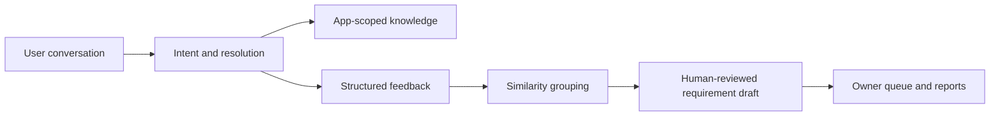

<div align="center">

# Feedback Agent

**AI customer support that turns every conversation into product evidence.**

[简体中文](README.zh-CN.md) · [Architecture](docs/architecture.md) · [API](docs/api.md) · [Deployment](docs/deployment.md)

[](https://github.com/yjsf216/feedback-agent/actions/workflows/ci.yml)
[](LICENSE)
[](.node-version)
[](.fvmrc)

</div>

Feedback Agent is a self-hosted, multi-app customer-support and
Voice-of-Customer platform. It answers user questions, then turns the same
conversation into structured feedback: intent, category, pain points, impact,
duplicate signals, draft requirements, owner follow-up, and reports.

It is built for product teams that want one reusable feedback layer across
Flutter apps and the web without shipping model keys or app secrets to client
devices.

## Why teams use it

| Product outcome                       | What the platform does                                                           |
| ------------------------------------- | -------------------------------------------------------------------------------- |
| Resolve common questions              | Retrieves app-scoped knowledge and streams cited answers                         |
| Capture feedback without another form | Extracts intent, pain points, impact, and resolution state from the conversation |
| Find repeated demand                  | Groups similar feedback while preserving original evidence                       |
| Keep AI accountable                   | Creates requirement drafts; a human confirms, rejects, or merges them            |
| Reuse one backend                     | Isolates configuration, credentials, knowledge, and data by validated app ID     |
| Meet users where they are             | Provides a public Next.js entry and an embeddable Flutter SDK                    |

## From conversation to action



LangGraph.js runs inside the NestJS API as a controlled workflow with explicit
state and decision boundaries. The project deliberately avoids an open-ended
multi-agent conversation for this path: support and feedback processing need
predictable latency, traceable evidence, and human approval.

## What is included

- NestJS API with authentication, app isolation, Swagger, SSE, and LangGraph.
- BullMQ worker for knowledge ingestion, feedback extraction, deduplication,
  and report generation.
- PostgreSQL with pgvector, Redis, and S3-compatible object storage.
- Next.js public landing page and bilingual feedback conversation.
- Vue 3 administration console for apps, knowledge, conversations, feedback,
  requirements, owner queues, model settings, and reports.
- Flutter client, controller, full-page UI, embedded view, launcher, and
  Android/iOS/Web example.
- Local and production Docker Compose configurations.

## Quick start

Requirements: Node.js 22.13–26, pnpm 11, and Docker or OrbStack. FVM and
Flutter 3.44.2 are only required for Flutter SDK development.

```sh
git clone https://github.com/yjsf216/feedback-agent.git
cd feedback-agent
cp .env.example .env
pnpm install --frozen-lockfile
pnpm infra:up
pnpm db:generate
pnpm db:migrate
pnpm db:seed
pnpm dev
```

Open:

- Web: http://localhost:3000
- Demo conversation: http://localhost:3000/feedback/demo
- Admin: http://localhost:8848
- API and Swagger: http://localhost:4100/docs
- MinIO Console: http://localhost:9001
- Mailpit: http://localhost:8025

The development seed reads ADMIN_EMAIL and ADMIN_PASSWORD from your local
.env file. Empty model keys enable a deterministic fallback for testing the
workflow; they do not represent real model quality.

## Flutter integration

Use the SDK directly from this repository until a registry release is ready:

```yaml
dependencies:
  feedback_agent_flutter:
    git:
      url: https://github.com/yjsf216/feedback-agent.git
      path: packages/flutter_sdk
```

```dart
final client = FeedbackAgentClient(
  baseUri: Uri.parse('https://feedback-api.example.com'),
  appSlug: 'my-product',
);

final controller = FeedbackChatController(gateway: client);
```

Use FeedbackChatPage for a complete route, FeedbackChatLauncher for a floating
entry, or FeedbackChatView inside an existing screen. Existing app identity
must be exchanged by the host backend; never place an app secret or model key
in a Flutter binary. See the [Flutter SDK guide](packages/flutter_sdk/README.md).

## Production deployment

The production Compose stack binds API, Web, Admin, and the MinIO console to
127.0.0.1; PostgreSQL, Redis, and the MinIO API stay on the Docker network.
Put a TLS reverse proxy in front of the public services and never publish the
MinIO console, database, or Redis directly.

```sh
cp .env.production.example .env.production
# Replace every placeholder and public URL before continuing.
pnpm prod:config
pnpm prod:build
pnpm prod:up
pnpm prod:bootstrap  # first initialization only
```

Read the [deployment and backup guide](docs/deployment.md) before using the
stack with real feedback.

## Security boundaries

- Every domain query is scoped by a server-validated app ID.
- Model keys, signing credentials, and app secrets stay server-side.
- AI-generated requirements remain drafts until a human acts.
- Example credentials are for local development only.
- Do not put production exports, conversations, screenshots with user data,
  environment files, or private keys in the repository.

Please report vulnerabilities through GitHub private vulnerability reporting,
not a public issue. See [SECURITY.md](SECURITY.md).

## Project status

Feedback Agent is an early-stage, working MVP. The main support-to-feedback
flow, multi-app isolation, Flutter/Web entry points, administration console,
and single-host deployment are implemented. Real-time human takeover,
scheduled reports, recursive crawling, OCR, voice, message attachments, and
external notification webhooks are not implemented yet.

## Contributing

Bug reports, integration examples, documentation improvements, and focused
pull requests are welcome. Start with [CONTRIBUTING.md](CONTRIBUTING.md) and
the [open-source policy](docs/open-source-policy.md). If this project matches
your workflow, a GitHub star or a concrete use-case Discussion helps shape the
roadmap.

## License

Original Feedback Agent code is licensed under the [Apache License 2.0](LICENSE).
The administration app contains MIT-licensed pure-admin-thin code; its original
notice remains in [apps/admin/LICENSE](apps/admin/LICENSE). See
[THIRD_PARTY_NOTICES.md](THIRD_PARTY_NOTICES.md) for details.
