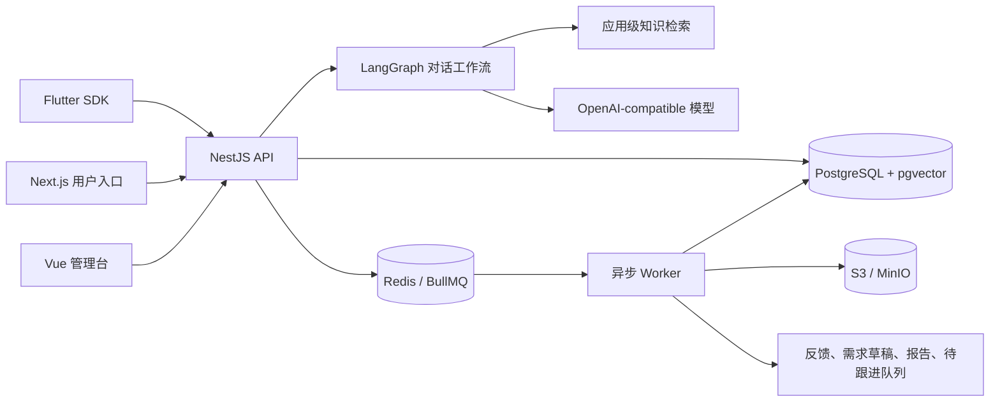

# Feedback Agent 用户反馈智能体平台

一个可被多个 App 共用的 AI 客服与用户反馈基础设施。用户先与机器人对话解决问题，系统同时完成意图识别、需求归类、痛点提炼、反馈去重、需求草稿生成，并把未解决问题送入负责人队列。

这类系统可以叫“用户反馈智能体”“AI 客服与反馈 Agent”或“Voice of Customer Agent”。本项目采用一个可控的 LangGraph 工作流，不使用多个角色互相聊天的 CrewAI/AutoGen 模式。

## 已实现能力

| 入口与能力 | 当前实现 |
| --- | --- |
| Flutter App | 可复用 API Client、Controller、完整页面、嵌入 View、悬浮 Launcher |
| 无 App 用户 | Next.js 品牌首页和 `/feedback/[appSlug]` 双语聊天入口 |
| 客服问答 | 应用级知识检索、SSE 流式回复、来源和置信度展示 |
| 身份 | 匿名访客、邮箱账号、宿主后端签名换票；刷新令牌轮换 |
| 反馈处理 | 意图识别、结构化反馈、痛点与影响提炼、相似反馈归并 |
| 需求管理 | AI 只创建草稿，管理员确认、拒绝、合并和推进状态 |
| 人工跟进 | 未解决队列、内部处理状态、对话证据和解决确认 |
| 知识库 | FAQ、单页 URL、PDF；BullMQ 异步解析和向量化 |
| 报告 | 按应用与时间范围手动生成反馈报告 |
| 多应用 | 全链路 `appId` 隔离、独立品牌/认证/模型/知识配置 |
| 部署 | 本地 Compose、生产多阶段镜像与单机生产 Compose |

当前 MVP 不包含实时人工接管、定时报告、递归爬虫、OCR、语音、消息附件和外部 Slack/邮件通知。未解决问题会进入管理台负责人队列；外部通知可在后续接入 Webhook。

## 架构



选择 LangGraph 的原因是流程有明确状态、分支和人工确认点，需要持久化检查点、可恢复执行和可测试的确定性边界。CrewAI/AutoGen 更适合开放式多角色协作，在本场景会增加延迟、成本和不可控性。详细边界见 [架构说明](docs/architecture.md)。

## 目录

```text
feedback_agent/
├── apps/
│   ├── api/             NestJS API、认证、LangGraph 编排和管理接口
│   ├── worker/          BullMQ 知识解析、反馈提炼、归并和报告任务
│   ├── web/             Next.js 公开首页与用户聊天页
│   └── admin/           Vue 3 / pure-admin 管理后台
├── packages/
│   ├── agent-core/      可测试的工作流状态和节点
│   ├── contracts/       TypeScript/Zod 公共协议
│   ├── database/        Prisma Schema、迁移和种子数据
│   └── flutter_sdk/     Flutter SDK 与 Android/iOS/Web 示例
├── infra/               本地与生产 Docker Compose
└── docs/                架构、API、部署和前端设计说明
```

## 本地启动

前置要求：Node.js 22.13–26、pnpm 11、Docker/OrbStack。开发 Flutter SDK 时还需要 FVM 与 Flutter 3.44.2。

```sh
cd /Users/caolei/Android/codexWorkspace/feedback_agent
cp .env.example .env
pnpm install --frozen-lockfile
pnpm infra:up
pnpm db:generate
pnpm db:migrate
pnpm db:seed
pnpm dev
```

本地入口：

- 用户 Web：[http://localhost:3000](http://localhost:3000)
- 示例反馈页：[http://localhost:3000/feedback/demo](http://localhost:3000/feedback/demo)
- 管理台：[http://localhost:8848](http://localhost:8848)
- API 与 Swagger：[http://localhost:4100/docs](http://localhost:4100/docs)
- MinIO Console：[http://localhost:9001](http://localhost:9001)
- Mailpit：[http://localhost:8025](http://localhost:8025)

种子管理员默认为 `.env` 中的 `ADMIN_EMAIL` / `ADMIN_PASSWORD`；首次部署前必须修改密码。未配置模型密钥时会启用可测试的确定性回退逻辑，适合开发流程验证，不等同于真实模型效果。

## Flutter 接入

SDK 文档和完整示例位于 [packages/flutter_sdk/README.md](packages/flutter_sdk/README.md)。本地快速运行：

```sh
cd packages/flutter_sdk/example
fvm flutter run -d chrome --web-port 8080
```

宿主 App 已有账号体系时，必须由业务后端调用签名换票接口；Flutter 客户端只接收短期 access token 与轮换 refresh token，不能包含 App Secret 或模型 Key。签名协议见 [API 接入契约](docs/api.md)。

## 管理工作流

1. 在“应用管理”创建或选择应用，设置品牌、认证和模型。
2. 在“知识库”录入 FAQ，或提交 PDF/单页 URL 等待 Worker 处理。
3. 用户从 Web 或 Flutter 发起对话；高置信度知识答案直接回复。
4. 低置信度、未解决或明确反馈进入管理台；Worker 提炼反馈与痛点。
5. AI 创建的需求保持 `DRAFT`，负责人根据原始证据确认、合并或拒绝。
6. 在“报告”按应用和时间范围生成汇总。

## 常用命令

```sh
pnpm build              # 构建所有 Node/Web/Admin 包
pnpm lint               # 全仓 ESLint
pnpm typecheck          # 全仓 TypeScript 检查
pnpm test               # 全仓 Node 测试
pnpm format:check       # Prettier 检查
pnpm sdk:analyze        # Flutter SDK 静态检查
pnpm sdk:test           # Flutter SDK 单元测试
```

## 生产部署

单机部署的最短路径：

```sh
cp .env.production.example .env.production
# 修改所有密码、密钥和公开 URL
pnpm prod:config
pnpm prod:build
pnpm prod:up
pnpm prod:bootstrap     # 仅首次创建管理员和 demo 应用
```

生产 Compose 不向宿主机暴露 PostgreSQL 和 Redis；API、用户 Web、管理台与 MinIO Console 端口可配置。正式环境应在前方配置 TLS 反向代理、限制 MinIO Console 访问并建立数据库/对象存储备份。完整说明见 [生产部署](docs/deployment.md)。

## 文档索引

- [架构与技术选择](docs/architecture.md)
- [API 与签名换票](docs/api.md)
- [生产部署与运维](docs/deployment.md)
- [前端设计规范](docs/frontend-design.md)
- [Flutter SDK](packages/flutter_sdk/README.md)
