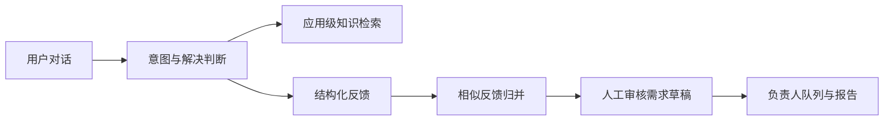

<div align="center">

# Feedback Agent 用户反馈智能体

**把客服对话变成可追踪、可归并、可决策的产品证据。**

[English](README.md) · [架构](docs/architecture.md) · [API](docs/api.md) · [部署](docs/deployment.md)

</div>

Feedback Agent 是一套可自托管、可供多个 App 共用的 AI 客服与用户反馈平台。
它先回答用户问题，再从同一段对话中提取意图、分类、痛点、影响和解决状态，
归并相似反馈，生成待人工确认的需求草稿，并进入负责人队列与报告。

它适合希望在 Flutter App 和 Web 中复用同一套反馈基础设施，同时不把模型密钥、
App Secret 或业务规则放进客户端的产品团队。

## 为什么不是普通聊天机器人

| 产品目标     | Feedback Agent 的处理方式                          |
| ------------ | -------------------------------------------------- |
| 解决常见疑问 | 检索应用级知识并通过 SSE 返回带来源的答案          |
| 降低反馈门槛 | 用户正常聊天即可完成意图、痛点、影响和解决状态采集 |
| 发现重复需求 | 归并相似反馈，同时保留原始对话证据                 |
| 控制 AI 风险 | AI 只创建需求草稿，由管理员确认、拒绝或合并        |
| 服务多个产品 | 配置、凭据、知识和数据按服务端校验后的 appId 隔离  |
| 覆盖不同入口 | 提供 Next.js Web 入口与可嵌入 Flutter SDK          |

## 核心流程



LangGraph.js 运行在 NestJS API 内，以显式状态和分支控制工作流。这个场景需要
可预测延迟、可追踪证据和人工确认，因此没有采用多个角色开放式互聊的模式。

## 已包含

- NestJS API：认证、应用隔离、Swagger、SSE 和 LangGraph 编排。
- BullMQ Worker：知识解析、反馈提炼、归并和报告任务。
- PostgreSQL/pgvector、Redis 与 S3/MinIO。
- Next.js 产品首页与中英文用户反馈页。
- Vue 3 管理台：应用、知识、对话、反馈、需求、待跟进、模型与报告。
- Flutter Client、Controller、完整页面、嵌入 View、悬浮入口和示例工程。
- 本地与生产 Docker Compose。

## 快速启动

需要 Node.js 22.13–26、pnpm 11 和 Docker/OrbStack。只有开发 Flutter SDK 时
才需要 FVM 与 Flutter 3.44.2。

```sh
git clone https://github.com/yjsf216/feedback-agent.git
cd feedback-agent
cp .env.example .env
pnpm install --frozen-lockfile
pnpm infra:up
pnpm db:generate
pnpm db:migrate
pnpm db:seed
pnpm dev
```

本地入口：

- 产品首页：http://localhost:3000
- 示例反馈页：http://localhost:3000/feedback/demo
- 管理后台：http://localhost:8848
- API 与 Swagger：http://localhost:4100/docs
- MinIO Console：http://localhost:9001
- Mailpit：http://localhost:8025

开发管理员账号来自本地 .env 中的 ADMIN_EMAIL 与 ADMIN_PASSWORD。模型 Key
为空时会使用确定性回退逻辑，适合验证流程，不代表真实模型效果。

## Flutter 接入

在发布到包仓库前，可以直接引用 Git 仓库中的 SDK：

```yaml
dependencies:
  feedback_agent_flutter:
    git:
      url: https://github.com/yjsf216/feedback-agent.git
      path: packages/flutter_sdk
```

宿主 App 已有账号体系时，必须由业务后端完成签名换票；Flutter 端只接收短期
访问令牌，不能包含 App Secret 或模型 Key。完整说明见
[Flutter SDK 文档](packages/flutter_sdk/README.md)。

## 生产部署

生产 Compose 默认把 API、Web、Admin 和 MinIO Console 绑定到 127.0.0.1；
PostgreSQL、Redis 和 MinIO API 只在 Docker 内网可访问。公开服务前必须配置
HTTPS 反向代理，不能直接暴露数据库、Redis 或 MinIO Console。

```sh
cp .env.production.example .env.production
# 替换全部占位符和公开 URL 后再继续
pnpm prod:config
pnpm prod:build
pnpm prod:up
pnpm prod:bootstrap  # 仅首次初始化
```

正式使用真实反馈前，请先阅读[部署、备份与恢复文档](docs/deployment.md)。

## 安全边界

- 所有业务查询都使用服务端校验后的 appId。
- 模型密钥、签名凭据和 App Secret 只保存在服务端。
- AI 生成的需求始终先进入草稿，由人确认。
- 示例账号只用于本地开发。
- 生产导出、用户对话、包含个人信息的截图、环境文件和私钥不能进入仓库。

安全问题请使用 GitHub 私密漏洞报告，不要公开提交 Issue。详见
[SECURITY.md](SECURITY.md)。

## 当前状态

项目目前是可运行的早期 MVP。客服到反馈的主流程、多应用隔离、Flutter/Web
入口、管理台和单机部署已经实现。实时人工接管、定时报告、递归爬虫、OCR、
语音、消息附件和外部通知 Webhook 尚未实现。

## 参与贡献

欢迎提交可复现 Bug、接入案例、文档改进和聚焦的 Pull Request。请先阅读
[贡献指南](CONTRIBUTING.md)和[开源政策](docs/open-source-policy.md)。

## 许可证

Feedback Agent 原创代码使用 [Apache License 2.0](LICENSE)。管理后台包含
MIT 许可的 pure-admin-thin 代码，原始许可证保留在
[apps/admin/LICENSE](apps/admin/LICENSE)。第三方说明见
[THIRD_PARTY_NOTICES.md](THIRD_PARTY_NOTICES.md)。
