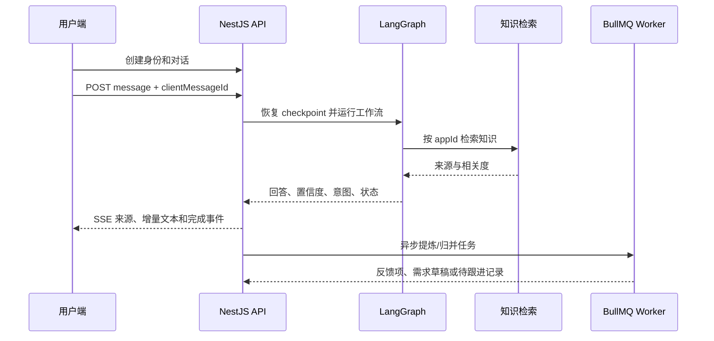

# 架构与技术选择

## 为什么是 LangGraph

用户反馈流程本质上是带状态的工作流：理解问题、检索知识、判断置信度、回答、识别反馈、提炼痛点、创建待审需求或进入人工队列。每一步都有明确输入输出和失败恢复要求。

因此核心采用 LangGraph.js：

- 节点与条件分支可单测，不依赖“多个角色自由对话”；
- PostgreSQL checkpoint 支持中断恢复和后续人工确认；
- 能把模型调用限制在真正需要语义判断的位置；
- 便于记录每一步结果、置信度和使用量。

CrewAI 与 AutoGen 更适合开放式多 Agent 协作或探索任务。这个系统需要低延迟、稳定成本、数据隔离和审计，不需要角色扮演式协商，因此不作为主运行时。未来若报告研究或跨系统调查需要开放式协作，可作为独立后台任务接入，而不改变在线客服链路。

## 运行边界

- Next.js、Vue 管理台和 Flutter SDK 使用同一个版本化 NestJS API。
- NestJS 校验应用与用户上下文，通过 Prisma 保存业务数据，通过 SSE 返回 LangGraph 结果。
- LangGraph checkpoint 使用 PostgreSQL 的独立 `langgraph` schema；Prisma 管理 `public` 业务表。
- BullMQ Worker 处理 PDF/URL、Embedding、反馈提炼、相似反馈归并、对话关闭总结和手动报告。
- 原始上传进入 S3-compatible 存储，知识片段与向量进入 PostgreSQL + pgvector。
- 每个管理查询、向量查询和异步任务都携带并校验 `appId`。

## 在线对话路径

## 信任边界

- App Slug 与公开配置只负责发现入口和品牌展示，不授权任何特权操作。
- 宿主业务后端使用 App Credential 为换票请求做 HMAC-SHA256；该 Secret 永远不能进入 Flutter/Web 包。
- Flutter 使用平台安全存储保存反馈会话；Web MVP 使用浏览器 localStorage 保存 bearer 会话，因此必须依赖严格的 XSS 防护和 HTTPS。更高安全等级部署应改为同源 BFF + HttpOnly Cookie。
- Access Token 短期有效，Refresh Token 每次刷新都会轮换，退出时服务端撤销。
- 模型 Key 与 App Credential 使用 AES-256-GCM 加密后入库；生产环境必须提供稳定的 32 字节 `APP_ENCRYPTION_KEY`。
- API 管理接口从服务端令牌和 `X-App-Id` 共同确定范围，不能由普通用户越权覆盖。

## 数据与人工确认

- 原始对话是证据，不会被 AI 摘要替代。
- 反馈项保存类型、痛点、影响、严重度、摘要和来源对话。
- 相似反馈可以链接到同一需求，但 AI 只能生成 `DRAFT`。
- 需求确认、拒绝、合并、规划和完成由管理员操作并写入审计日志。
- 低置信度与用户标记“仍需帮助”的对话进入待跟进队列；当前没有实时人工接管。

## MVP 边界

当前版本包含手动报告和内部待跟进队列，不包含外部 Slack/邮件/Webhook 通知、定时报告、OCR、递归抓取、语音与附件消息。增加通知时应由 Worker 消费领域事件，并保证重试、幂等、退避和每应用独立配置，避免把第三方调用放进在线回答链路。
